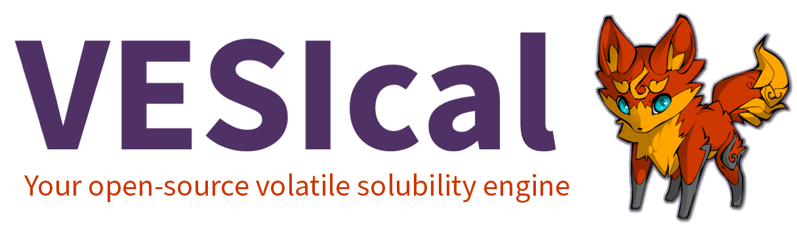

##################
VESIcal Quickstart
##################

.. toctree::
   :maxdepth: 2
   :caption: Contents:

   install
   changelog
   about
   models
   quick_tutorials
   tutorials
   advanced_tutorials
   youtube
   integration
   workshops
   codedoc
   faq
   support
   license

Installation
^^^^^^^^^^^^
VESIcal can be installed with pip:

.. code-block:: python

    pip install VESIcal

Always use the most up-to-date version of the code:

.. code-block:: python

   pip install VESIcal --upgrade

See the installation section for detailed instructions and dependencies.

Indices and tables
^^^^^^^^^^^^^^^^^^

* :ref:`genindex`
* :ref:`modindex`
* :ref:`search`
