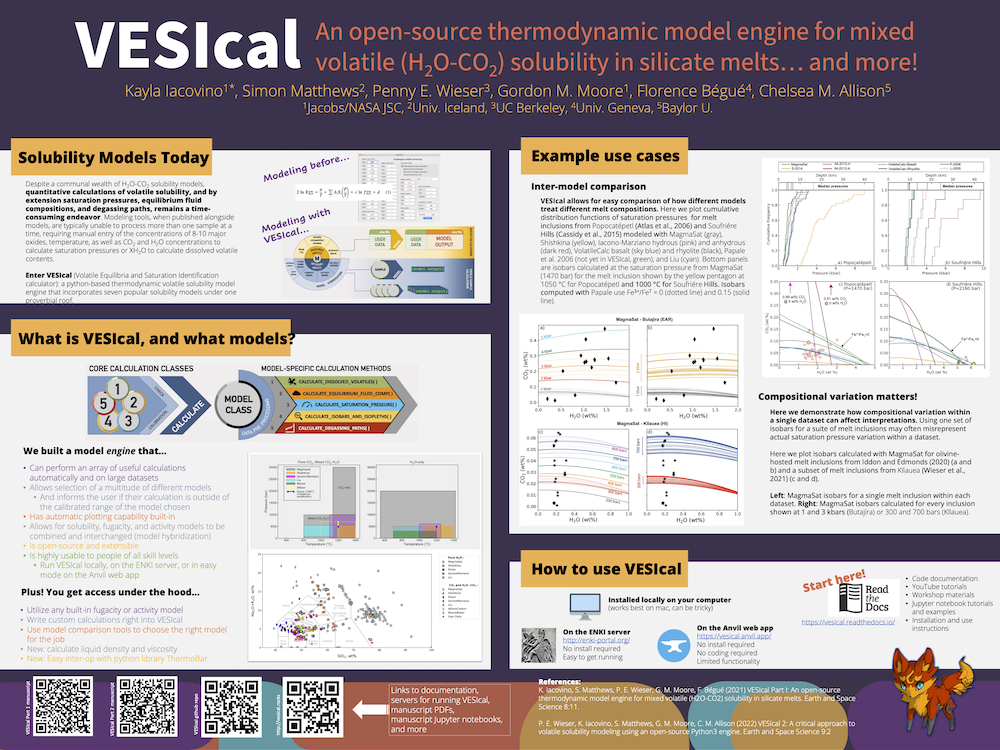

###########################
Workshops and Presentations
###########################

Here we post resources and recorded lectures and demonstrations made during workshops, conferences, and seminars.

IAVCEI Modelling Volatile Behaviour in Magmas Workshop 2023
^^^^^^^^^^^^^^^^^^^^^^^^^^^^^^^^^^^^^^^^^^^^^^^^^^^^^^^^^^^
Volatiles are a critical component of magmas, driving volcanic eruptions, creating and modifying planetary atmospheres, and generating ore deposits. There has been an immense amount of work quantifying the solubility of individual volatile species in a wide variety of magma compositions and the creation of various modelling capabilities to look at magmatic degassing. This workshop aims to bring together experimentalists, numerical modellers, and observational researchers with an interest in volatile solubility in magmas. Through group discussions, model demonstrations, and keynote talks, we will explore the current landscape and look for future directions. We will start with a demonstration session of existing models and codes. There is currently no benchmarking for such codes, so we will discuss options for a benchmarking exercise and test datasets. This will be followed by discussions on future directions, covering: (1) what are the experimental gaps (e.g., melt compositions, volatile species, PT ranges, fugacity coefficients, non-ideal mixing, etc.); (2) what do observational researchers need these codes to be able to do; (3) how would we incorporate disequilibrium/isotopic fractionation, (4) how do we incorporate interaction with hydrothermal systems, and (5) can we link monitoring needs to solubility outputs? This workshop will be hybrid, with the opportunity for pre-submitted talks/written work, and a summary of the workshop will be released afterwards, with the opportunity for comment, to ensure as many people as possible can participate. There is scope for exploring a dedicated special issue on this topic following this workshop. 

**All videos from this workshop are available in this YouTube playlist:**

.. raw:: html

   <iframe width="560" height="315" src="https://www.youtube.com/embed/videoseries?list=PLDSC0wbXSKIziryb7vgWOFdYhMlvkd4KL" title="YouTube video player" frameborder="0" allow="accelerometer; autoplay; clipboard-write; encrypted-media; gyroscope; picture-in-picture; web-share" allowfullscreen></iframe>
   
   
**Links to the individual videos in this playlist:**

* `Part 1 - Introduction <https://youtu.be/dli2IeL3Zxw>`_
* `Part 2.1 - Introduction to VESIcal <https://youtu.be/yVEvR-jNPZ8>`_
* `Part 2.2 - Introduction to Sulfur_X <https://youtu.be/1wHvDy4Q9rU>`_
* `Part 2.3 - Introduction to CHOSETTO <https://youtu.be/zlyEOkaR3Yg>`_
* `Part 2.4 - Introduction to SCHOFe <https://youtu.be/8U27ph5D45g>`_
* `Part 2.5 - Model Benchmarking & Intercomparison <https://youtu.be/Wx785sir0vU>`_
* `Part 3.1 - Keynote 1: Penny Wieser and Shuo (Echo) Ding - What are the modelling and experimental gaps? <https://youtu.be/SYxRCRR-nlo>`_
* `Part 3.2 - Keynote 2: Margaret Hartley - What do observational researchers need codes to do? <https://youtu.be/wanPnJTchdM>`_
* `Part 4 - Breakout Report and Wrap-up <https://youtu.be/aHDUx_sbPe4>`_

---------

Virtual VMSG 2022
^^^^^^^^^^^^^^^^^
The Jupyter notebooks are available on the `workshop repository <https://github.com/simonwmatthews/VESIcal_Workshop_VMSG22>`_

The exercises can also be run interactively on the cloud using myBinder

.. image:: https://mybinder.org/badge_logo.svg
 :target: https://mybinder.org/v2/gh/simonwmatthews/VESIcal_Workshop_VMSG22/HEAD?labpath=01_Introduction.ipynb

Videos for the lectures and demonstrations are available on `YouTube <https://www.youtube.com/playlist?list=PLDSC0wbXSKIzQuLHMc4x37smOgT-_j7kM>`_

---------

Poster: Volatiles from source to surface workshop 2022
^^^^^^^^^^^^^^^^^^^^^^^^^^^^^^^^^^^^^^^^^^^^^^^^^^^^^^
Click on the image below for the PDF.

